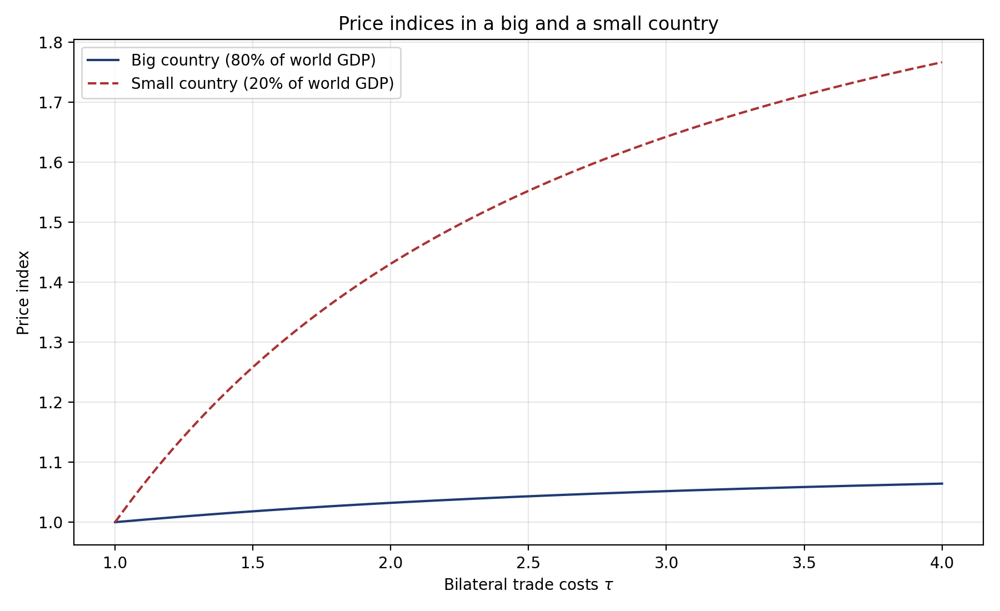
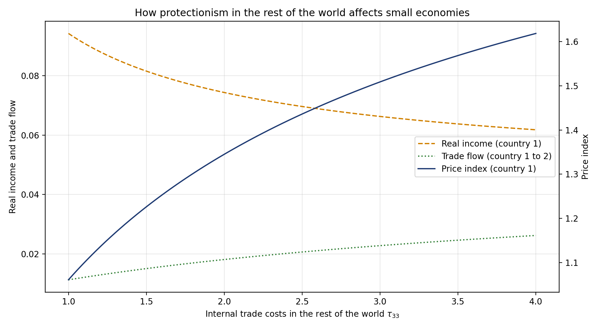

# Introduction

In the words of the poet:

> Nature and Nature's laws lay hid in night
>
> God said, Let Newton be! and all was light. --- Alexander Pope

Such a claim seems to be appropriate even to explain trade, since one of the most famous empirical results emerging from international economics is the finding that bilateral trade increases with gross domestic products (GDP) and decreases with distance. This result comes from the gravity equation, which takes its name from the *law of universal gravitation* summarized in the following equation:

$$X_{ij}=G\frac{Y_{i}Y_{j}}{\tau_{ij}^{2}}.$$ {#eq-naive}

Through this equation Newton (1687) ensures that an object $i$ attracts another $j$ with a force ($X_{ij}$) which is directly proportional to the product of their masses ($Y_{i}Y_{j}$) and inversely proportional to the square of the distance between them ($\tau_{ij}$). The universal law of concentration of mass in stars and planets offers analogies to social and economic landscapes too. In international trade, the masses are Gross Domestic Products (GDP) and $X_{ij}$ is the flow of goods from country $i$ to country $j$. @Tinbergen1962 is the first to test such a relationship with success, without any theoretical foundation.[^1] Leamer (1966) then used the gravity equation to measure the protectionism of countries through the distortions it creates in trade flows, after controlling for supply and demand determinants of trade and distance costs. This approach indirectly measures the degree of trade openness by studying the residual, so that it complements and improves direct measures of trade protection, which can be hard to determine when there are data gaps and hidden protections. Many studies follow such seminal works by using the gravity relation to explain the variance in bilateral trade volumes.[^2] Our aim in this course is not to provide an exhaustive presentation of everything that has been done since these seminal works, but rather to select specific works and examples that enlighten how trade flows can be predicted in international economics; as we are going to see, the gravity equation is often involved in any model that quantifies the effect of trade. Codes in R and Python[^3] are provided to estimate the gravity equation and to solve the model.

[^1]: Gravity equations had been tested previously in other fields. The first author to apply gravity to economics is perhaps Carey (1858), who considered that migrations follow the law of gravitation. He is quite radical in claiming: "Man, the molecule of society, is the subject of Social Science.... The great law of Molecular Gravitation is the indispensable condition of the existence of the being known as man.... The greater the number collected in a given space, the greater is the attractive force that is exercised.... Gravitation is here, as everywhere, in the direct ratio of the mass, and the inverse one of distance." Quoting from Gallup (1997).

[^2]: See @Head2014.

[^3]: Why different software? No particular reason, just to prepare students to jump from one software to another.

We are going to start this course by estimating the ad-hoc gravity equation (@eq-naive). This estimation is now easy since many institutions, like CEPII, provide datasets that contain every variable that is needed. However, you'll really learn how to code by doing this yourself and by starting from scratch. Indeed, a gravity estimation requires gathering data that are defined on a bilateral basis (trade flows from $i$ to $j$) and over time (for several years $t$); this is a very complete exercise that will be useful for you in many other applications.

**Exercise.** Use the software you want (STATA, R, Python, SAS, etc.) to complete the following exercise, based on the dataset provided on the course website in the folder "Exercices/A1_scratch". The correction is done with R in the file "grav_eng.Rmd" (available on request; I also have it in STATA and SAS).

1.  Merge the two bilateral databases, "dist" and "baci_agg.sas7bdat", that provide bilateral distances and bilateral trade flows. Alas, you will face a first problem: in the BACI database, countries are named by numbers, whereas in the "dist" database they are named by letters only. To merge these two tables, you will need a mapping table. This correspondence table is in the "total2.xls" file, in the sheet "correspays". You'll see along the way that other problems await you.
2.  Merge GDPs, both for country $i$ and country $j$, available in "total2.xls", sheet "pib".
3.  Estimate this equation with a TWFE.

# Empirical analysis

## Three puzzles

The Newton equation presented in @eq-naive, also called the naive gravity equation, has often been estimated with OLS after a log linearisation, such as:

$$\ln X_{ijt}=\ln Y_{it}+\ln Y_{jt}+\ln\tau_{ij}+\epsilon_{ijt},$$ {#eq-ols}

where trade costs are approximated by a vector of bilateral dummies to reduce endogeneity bias (due to omitted variables), such as a shared language, past colonial links, Regional Trade Agreement (RTA) and so on. Such an empirical strategy has led to many puzzling results, and three important debates have been opened.

The first puzzle concerns the impact of the GATT/WTO on bilateral trade. Although it is usually taught that the GATT, and then the WTO, ushered in an era of strong integration through a sharp fall in tariffs --- at least in the industrial sector --- @Rose2004 famously found that members do not trade more than non-members. The early reaction was about measurement: @Tomz2007 noted that many non-member *participants* (colonies, de facto members) should be counted as treated, which already restores a sizeable effect. But the deeper resolution came from estimating the gravity equation properly. Using the very tools presented in this course --- exporter-time and importer-time fixed effects for the multilateral resistances, country-pair fixed effects to absorb endogeneity, and, crucially, domestic trade flows so that membership is measured relative to internal sales (which captures the non-discriminatory, most-favoured-nation nature of GATT/WTO commitments) --- @Larch2025 find a large and significant effect: joining the GATT/WTO raised trade between members by about 171% and between members and non-members by about 88%. The original "no-effect" result is now understood as an artifact of gravity equations estimated without multilateral resistance and without intranational trade.

The second puzzle, from the same author, concerns the effect of Customs Unions, which are said to triple trade according to @Rose2000. This result seems too high to be real, and @Glick2002 revisit it, finding a smaller but still high number (doubling trade). Using different estimators and data sets, several authors have "shrunk" the CU coefficients [@Nitsch2002]. However, the debate is not closed. On both sides, the main unresolved problems concern reverse causality and selection. Bilateral trade certainly explains why countries sign CUs, and signatories have particular characteristics relative to the treatment that are different from those of non-members. Countries never sign a CU at random.[^4] This is true for CUs, but also for all other types of trade agreements.

[^4]: However, @VicqueryRoger2021 has succeeded in finding an "accidental monetary union" and shows that the effect is still strong in that case, without selection bias.

The third puzzle has been raised regarding the effect of borders when a deep Regional Trade Agreement (RTA) has been set. @McCallum1995 highlights that despite the logical idea that a regional trading bloc such as NAFTA makes national borders less important, borders have kept their impact on trade. He underlines his idea by providing an empirical study on the Canada-US border, which is an interesting case because of similar conditions (e.g. language, culture and institutions). Surprisingly, McCallum finds that regional trade between Canadian provinces is 22 times larger than international trade between Canadian provinces and US states, after controlling for size and distance. That's an impressive number, which reveals a strong border effect despite the implementation of NAFTA. Yet the question might be mitigated or resolved by working with more accurate data, with more complex gravity equations and with different econometric techniques. We will define this in detail in what follows, but for now we may just recall that one of the solutions to better measure the bilateral trade friction has been to introduce fixed effects to control for omitted variables. For instance, @Anderson2003 find that the border effect is smaller when general equilibrium constraints are taken into account: for instance Canadian provinces trade 10.7 times more among themselves than with the US (cf. 22 times in @McCallum1995).

## Fixed effects

In addition to the introduction of fixed effects, a consensus has emerged to estimate the gravity equation with the PPML estimator in order to take into account zero trade flows and heteroskedasticity. See @Silva2006, @Head2014 and @Fally2015 for a discussion. Typically the equation estimated is the following:

$$X_{ijt}=\exp\left[f_{it}+f_{jt}+\kappa\tau_{ij}+\alpha\right]\epsilon_{ijt},$$ {#eq-ppml}

where $f_{it}$ and $f_{jt}$ are fixed effects and $\tau_{ij}$ is a vector of trade costs. Authors often use distance between partners and bilateral dummies to reduce endogeneity bias, such as common language, past colonial links, but also time-varying dummies such as the date of entry and exit of countries in an RTA, and so on.

**Exercise.** Upload from the course website the folder "Exercices/A2_gravity"; there are three folders: "input" that contains the data, "output" where results are stored, and "code". Everything is in R. Go into "code": 1) read and comment the script "data_processing.R", which builds the estimation sample from the raw CEPII data; look closely at the section on trade agreements, where the policy dummies are made mutually exclusive, since this is what decides the meaning of each coefficient in the table, 2) read and comment the script "estimation.R", 3) run the "master.R" file and comment the results.

To estimate the gravity equation, we use the dataset "gravity" from the CEPII, compiled by @Conte2022. We also add data on customs unions from @Sousa2012. Dummies on entry in the European Economic Community (EEC) (and another dummy for Europe) are computed from the code of @Mayer2019.

In @tbl-gravity we present these estimations. The first column presents results of the gravity equation of Newton after log linearisation (@eq-ols). We can see here the three puzzles presented previously: the high impact of borders, the low impact of WTO/GATT membership and the strong effect of customs unions. Column 2 adds variables relative to the European Union, such as the fact of entering the European Economic Community (EEC), the single market after 1992 and a dummy for the countries that use the Euro. We get here new puzzling results, since all these dummies are negative. In column 3 we add time-varying effects ($f_{it}$ and $f_{jt}$): the WTO/GATT membership effect is stronger, the border effect is smaller, but other variables do not change much. This estimation does not allow us to analyse individual variables such as GDPs, which are collinear with $f_{it}$ and $f_{jt}$. Column 4 introduces bilateral fixed effects in addition. This impedes the analysis of bilateral variables that are constant over time, but it removes many puzzling results, at least for the EU. We get results that are quite similar to those obtained in the literature: the EEC, for instance, has enabled trade to increase by more than 100% for member countries ($\exp(0.747)-1\approx 1.11$), which is around the coefficient obtained by @Mayer2019. Finally, column 5 re-estimates the bilateral-fixed-effects specification with PPML.

|   | \(1\) Naive | \(2\) Naive EU | \(3\) TWFE | \(4\) Bil. FE | \(5\) PPML |
|:-----------|:----------:|:----------:|:----------:|:----------:|:----------:|
| RTA dum. | 0.848^a^ (0.034) | 0.724^a^ (0.036) | 0.488^a^ (0.034) | 0.290^a^ (0.026) | -0.030 (0.049) |
| Shared currency dum. | 0.693^a^ (0.083) | 0.937^a^ (0.108) | 0.958^a^ (0.092) | 0.385^a^ (0.085) | 0.810^a^ (0.137) |
| Both GATT dum. | 0.093^a^ (0.020) | 0.085^a^ (0.020) | 0.405^a^ (0.036) | 0.096^b^ (0.038) | -0.200 (0.143) |
| ln distance | -1.027^a^ (0.015) | -1.013^a^ (0.015) | -1.328^a^ (0.017) | — | — |
| Shared border dum. | 0.605^a^ (0.076) | 0.635^a^ (0.075) | 0.405^a^ (0.072) | — | — |
| Shared language dum. | 0.759^a^ (0.032) | 0.736^a^ (0.032) | 0.633^a^ (0.029) | — | — |
| Colonial history dum. | 1.580^a^ (0.088) | 1.593^a^ (0.088) | 1.523^a^ (0.093) | — | — |
| Ever sibling dum. | 0.487^a^ (0.060) | 0.506^a^ (0.060) | 0.543^a^ (0.049) | — | — |
| ln Pop, origin | 1.054^a^ (0.006) | 1.060^a^ (0.006) | — | — | — |
| ln Pop, dest | 0.939^a^ (0.006) | 0.944^a^ (0.006) | — | — | — |
| ln GDP/Pop, origin | 1.174^a^ (0.007) | 1.180^a^ (0.007) | — | — | — |
| ln GDP/Pop, dest | 0.923^a^ (0.007) | 0.929^a^ (0.007) | — | — | — |
| Customs union | — | 0.993^a^ (0.089) | 0.741^a^ (0.079) | 0.537^a^ (0.068) | 0.102 (0.069) |
| EIA | — | 1.473^a^ (0.107) | 1.011^a^ (0.100) | 0.706^a^ (0.057) | 0.050 (0.049) |
| Euro area dum. | — | -0.161^b^ (0.067) | -0.345^a^ (0.089) | 0.089 (0.056) | 0.055 (0.040) |
| EU Econ. Community | — | -0.336^a^ (0.083) | -1.151^a^ (0.115) | 0.747^a^ (0.056) | 0.417^a^ (0.062) |
| EU single market 1992 | — | -0.375^a^ (0.099) | -0.339^a^ (0.100) | 0.658^a^ (0.061) | 0.397^a^ (0.039) |
| Observations | 751354 | 751354 | 834698 | 836489 | 838591 |
| $R^2$ | 0.633 | 0.634 | 0.731 | 0.862 | 0.990 |
| RMSE | 2.327 | 2.325 | 2.009 | 1.470 | — |

: Estimation of gravity equations {#tbl-gravity}

::: notes
**Note:** Dependent variable: bilateral trade flows (in logs for columns 1--4, in levels for the PPML column 5). Estimation by OLS in columns 1--4 and by PPML in column 5. Fixed effects: time in (1)--(2); origin-year ($it$) and destination-year ($jt$) in (3)--(5); country-pair ($ij$) added in (4)--(5). Standard errors in parentheses. The sample contains international flows only, with no country trading with itself; @sec-internal explains why this is a limitation and what it costs. **Reading:** the three puzzles visible in column 1 --- a large border effect, a near-zero GATT/WTO effect, and an outsized customs-union effect --- shrink markedly once the multilateral resistances ($it$, $jt$) and the pair fixed effects ($ij$) are introduced, and most EU dummies flip from negative to positive. The naive specification mismeasures policy effects precisely because it omits multilateral resistance. ^a^ $p<0.01$, ^b^ $p<0.05$, ^c^ $p<0.1$.
:::

## Internal trade flows {#sec-internal}

A subtle but consequential point, emphasized by the recent literature, is that the gravity equation should be estimated on **all** trade flows, including each country's trade with itself --- its *internal* or *domestic* trade $X_{ii}$, that is, shipments from a country's own producers to its own consumers. For a long time gravity regressions used international flows only and discarded the diagonal of the trade matrix. Yet internal trade is usually the *largest* flow in the data, since most of what a country consumes it produces at home. Two reasons make it important.

First, **international frictions are identified only relative to internal trade**. A border effect or a trade-cost elasticity has no natural zero: it can be measured only against the benchmark of how much a country trades with itself. This is exactly the comparison behind the McCallum border puzzle discussed above --- intra-national versus international trade --- and it is why a credible measure of the border effect needs the internal flow in the sample. @Yotov2022 shows that adhering to theory by including domestic trade flows materially changes gravity estimates.

Second, **non-discriminatory policies cannot be identified without internal trade**. A policy that moves a country's trade with *every* partner at once --- WTO membership, a general wave of globalisation, a uniform most-favoured-nation tariff --- is indistinguishable from an exporter-time or importer-time fixed effect when the data contain international flows only, because the fixed effect absorbs it. Adding domestic trade provides the within-country control that breaks this collinearity, so that the common component of the policy is identified against the country's own internal trade. @HeidLarchYotov2021 formalise this and show how to recover the effects of such unilateral, non-discriminatory policies. It is precisely the mechanism behind the resolution of the WTO puzzle above, and it is also why @DaiYotovZylkin2014 find that omitting internal trade biases the estimated effect of regional trade agreements, which divert trade away from members' domestic sales.

For these reasons, including domestic trade flows has become a standard recommendation of the modern gravity literature [@Yotov2016; @Yotov2022], and the structural gravity datasets now distributed for teaching and research (such as the WTO database used in the next subsection) report internal and international flows consistently. We will rely on this when we turn to general-equilibrium counterfactuals below, where the domestic expenditure share $\lambda_{jj}$ --- the share a country spends on its own goods --- is the sufficient statistic for the welfare effect of trade.

The reader should therefore treat @tbl-gravity with some caution. It is estimated on international flows only, as almost all of the literature was until recently, and this is one reason why the GATT/WTO coefficient there is so small.

## Trade agreements as a staggered difference-in-differences

The use of dummies to study policies that affect bilateral relationships between countries (e.g. new borders, migratory and trade policies) is quite common in the gravity literature. At least since @Baier2007, it has been considered central to estimate the effect of the enforcement of these policies with pair fixed effects, to control for all the unknown bilateral frictions. This two-way fixed effects (TWFE) approach addresses the endogeneity of bilateral policies due to the omitted variable bias (the one due to reverse causality remains a problem). However, two distinct problems remain. The pairs that serve as controls may not be comparable to those that sign, and they are not all treated at the same date, which biases the estimates. This section is devoted to estimators and methods that take into account these issues.

### Who serves as the control group?

To understand the first, let us describe the idea of "treatment" behind the estimation of the RTA effect with a dummy. By writing $RTA_{ij,t}$ we split the sample in two, the pairs that have an agreement in year $t$ being the treated and every pair with a zero serving as a control. That control group is not a neutral benchmark. It is dominated by country pairs that never sign anything, and those pairs are systematically unlike the ones that do. In the sample of @NagengastYotov2025 they lie on average 1,400 kilometres further apart, share a border three times less often, and share a common language less frequently. The pair fixed effects $\mu_{ij}$ absorb such differences in *levels*, which is why they are indispensable, but they say nothing about *trends*. Identification requires that trade between two countries which never sign an agreement would have grown at the same rate as trade between future members, had those members not signed. Since countries do not sign agreements at random, this may bias the whole analysis. In the words of the difference-in-differences (DiD) literature, the parallel trends assumption may be violated, and the estimate with it.[^5]

[^5]: @NagengastYotov2025 report these imbalances and add a specification in the spirit of regression adjustment that relaxes the parallel-trends requirement.

### Why the TWFE estimate is biased

The second difficulty concerns timing rather than comparability. An RTA dummy is, by construction, a *treatment that switches on at different dates for different country pairs*: the EEC pairs are treated from the late 1950s, the NAFTA pairs from 1994, and so on. This is *staggered treatment adoption*, and it creates a difficulty that is now well known. A pair treated late must be compared with pairs whose treatment is not changing at that moment. Some of those have been treated for years already. Since an agreement keeps raising trade for years after it enters into force, an early signatory is still adjusting when it serves as a control, so part of the control trend is itself a treatment effect. @NagengastYotov2025 propose an analysis that tackles this, and we follow their exposition here.[^6]

[^6]: Yotov maintains an extensive gravity reading list and replication codes at <https://yotoyotov.com/Gravity_Readings.pdf>, and the replication package for @NagengastYotov2025 (Stata, built on the `jwdid` command) is available on openICPSR at <https://www.openicpsr.org/openicpsr/project/194561/>. @LarchYotov2024 review sixty years of estimates of the effect of trade agreements.

Write the gravity equation we have with an explicit, possibly heterogeneous, treatment effect. Estimated by PPML on trade levels, the standard specification is

$$Y_{ij,t} = \exp\!\big[\,\delta^{\text{TWFE}}\,RTA_{ij,t} + f_{it} + f_{jt} + \mu_{ij} + \theta_{ii,t}\,\big]\,\epsilon_{ij,t},$$ {#eq-rta-twfe}

where $Y_{ij,t}$ is the trade flow (including the country's internal trade $Y_{ii,t}$), $f_{it}$ and $f_{jt}$ are the exporter-time and importer-time fixed effects that absorb the multilateral resistances, $\mu_{ij}$ are directional pair fixed effects, and $\theta_{ii,t}$ are domestic-trade-by-year dummies capturing globalisation. A single coefficient $\delta^{\text{TWFE}}$ is asked to summarise the effect of *every* agreement, in *every* year since its entry into force.

The trouble is that the effect of an RTA differs across agreements and grows over time. When treatment effects are heterogeneous like this, @deChaisemartin2020 and @GoodmanBacon2021 show that the TWFE coefficient is a **weighted sum of the underlying cohort-by-year treatment effects, and some of the weights can be negative**. As a result $\delta^{\text{TWFE}}$ need not even lie inside the range of the true effects; it can come out negative when every individual effect is positive. The culprit is the comparison described above, which @BorusyakJaravelSpiess2024 call a *forbidden comparison* because the regression uses already-treated pairs as a control group for pairs treated later.

A stylised example (two equal cohorts, three periods) makes the negative weight visible. Cohort $A$ signs in period 2 and cohort $B$ in period 3; let $\delta_{A2},\delta_{A3},\delta_{B3}$ be the true effects. Under parallel trends and no anticipation,

$$\delta^{\text{TWFE}} = \delta_{A2} - \tfrac{1}{2}\,\delta_{A3} + \tfrac{1}{2}\,\delta_{B3},
\qquad
\delta^{\text{ETWFE}} = \tfrac{1}{3}\,\delta_{A2} + \tfrac{1}{3}\,\delta_{A3} + \tfrac{1}{3}\,\delta_{B3}.$$ {#eq-twfe-bias}

The TWFE estimand puts a weight of $-\tfrac{1}{2}$ on $\delta_{A3}$, the *second-year* (mature) effect of the early cohort, because comparing $B$ against the already-treated $A$ between periods 2 and 3 subtracts $A$'s own growth in treatment effect. It therefore **overweights short-run effects and underweights long-run effects, and overweights late cohorts relative to early ones**. Since RTA effects grow with maturity, both biases push the conventional estimate *downward*.

### The fix: an extended TWFE (ETWFE)

The heterogeneity-robust DiD literature solves this by reversing the order of operations. Rather than imposing a single coefficient and letting the regression average the effects on its own, it estimates a separate effect for each treatment **cohort** $g$ (pairs whose RTA started in year $g$) and each post-treatment **year** $s$, using only clean comparisons against not-yet-treated and never-treated pairs (@CallawaySantAnna2021; @SunAbraham2021; @BorusyakJaravelSpiess2024). For the *non-linear* PPML gravity model, the convenient implementation is the **extended two-way fixed effects (ETWFE)** estimator of @Wooldridge2021 (linear) and @Wooldridge2023 (non-linear). It keeps the gravity equation untouched and only replaces the single RTA dummy by a full set of cohort-by-year interactions:

$$Y_{ij,t} = \exp\!\Big[\,\sum_{g=q}^{T}\sum_{s=g}^{T}\delta_{gs}\,D_{gs}^{ij} + f_{it} + f_{jt} + \mu_{ij} + \theta_{ii,t}\,\Big]\,\epsilon_{ij,t},$$ {#eq-etwfe}

where $D_{gs}^{ij}=1$ if pair $ij$ belongs to cohort $g$ and the year is $s\geq g$, and zero otherwise. Each $\delta_{gs}$ is now identified off a comparison free of forbidden controls, under a **no-anticipation** assumption and a **parallel-trends** assumption (stated as equal *ratios* of expected flows rather than equal differences, because the model is in exponential/multiplicative form). The many $\delta_{gs}$ are then aggregated into a single headline number with transparent weights,

$$\hat{\delta} = \sum_{g=q}^{T}\sum_{s=g}^{T}\frac{N_{gs}}{N_D}\,\hat{\delta}_{gs},$$ {#eq-etwfe-agg}

each cohort-year cell weighted by its share $N_{gs}/N_D$ in all treated observations, so that $\exp(\hat{\delta})-1$ is the average proportional effect of RTAs on trade. Averaging the $\delta_{gs}$ over cohorts instead of years yields a clean **event study** of how the effect builds up after entry into force.

### What changes in the results

Applied to the WTO Structural Gravity Database (manufacturing trade, 1980--2016, with internal trade), keeping every gravity best practice and changing *only* the treatment specification, the re-estimation roughly doubles the measured effect of trade agreements. The gap between the two columns is the downward bias that forbidden comparisons and the overweighting of short-run effects impart to the conventional estimate.

|                      |         TWFE          |         ETWFE         |
|:---------------------|:---------------------:|:---------------------:|
| RTA coefficient      | 0.166^\*\*\*^ (0.050) | 0.381^\*\*\*^ (0.041) |
| Implied trade effect |         +18%          |         +46%          |

: Conventional versus heterogeneity-robust RTA estimates [@NagengastYotov2025] {#tbl-etwfe}

::: notes
**Note:** Estimates of @NagengastYotov2025 on the WTO Structural Gravity Database (manufacturing, 1980--2016, 69 countries). PPML with exporter-time, importer-time and directional pair fixed effects, internal trade flows and globalisation controls; standard errors clustered by country pair in parentheses. The TWFE column imposes a single RTA dummy (@eq-rta-twfe), the ETWFE column the cohort-by-year saturation (@eq-etwfe). The implied trade effect is $\exp(\hat{\delta})-1$. ^\*\*\*^ $p<0.01$.
:::

Two further lessons are worth keeping. First, the event study shows the effect is not only larger but **spread over a longer horizon**: RTAs keep raising trade for many years and the static TWFE compresses this into the early years. Second, because anticipation contaminates the years just before entry into force, @NagengastYotov2025 date the treatment **onset three years before** the agreement legally enters into force. The correction generalises well beyond RTAs; the same logic applies to any staggered gravity policy (WTO accession, currency unions, sanctions) and to gravity equations for migration or FDI flows.

# Theory

This new literature on the gravity equation really starts with the contribution of @Anderson2003. In this section we present their theoretical model and briefly survey theoretical extensions.

## Standard model under perfect competition

@Anderson2003 --- AvW hereafter --- consider a *complete specialization* of countries according to the @Armington1969 assumption of goods differentiated by their country of origin. Thus, each good is produced in one country, but each consumer consumes *all goods* with *homothetic preferences* introduced with a standard *Constant Elasticity of Substitution* between varieties:

$$U_{j}=\left(\sum_{i=1}^{R}\beta_{i}^{\frac{1-\sigma}{\sigma}}c_{ij}^{\frac{\sigma-1}{\sigma}}\right)^{\frac{\sigma}{\sigma-1}}$$

where $c_{ij}$ is consumption by country $j$'s consumers of goods produced in $i$ (there are $R$ countries $i$, $j$ included), and $\sigma>1$ is the elasticity of substitution between varieties. Lastly the term $\beta_{i}$ introduces asymmetry in the model, where consumers' tastes depend on the origin country of the products. Utility is maximized under the constraint $\sum_{i=1}^{R}p_{ij}c_{ij}=E_{j}$, where $p_{ij}$ is the price of a good produced in $i$ and purchased in $j$. Prices differ between locations by reason of iceberg trade costs $\tau_{ij}$ between $i$ and $j$ (with $\tau\geq1$). A good produced in country $i$, and locally sold at $p_{i}$, is sold in country $j$ at the price $p_{ij}=p_{i}\tau_{ij}$. The nominal value of an exported variety is $X_{ij}=p_{ij}c_{ij}$, so by maximizing the utility function to obtain $c_{ij}$ and by using $p_{ij}=p_{i}\tau_{ij}$ one gets the total value of trade from $i$ to $j$:

$$X_{ij}=\left(\beta_{i}p_{i}\tau_{ij}\right)^{1-\sigma}\frac{E_{j}}{P_{j}^{1-\sigma}}$$ {#eq-avwdemand}

where $P_{j}$ is the consumption price index:

$$P_{j}=\left[\sum_{i=1}^{R}\left(\beta_{i}p_{i}\tau_{ij}\right)^{1-\sigma}\right]^{\frac{1}{1-\sigma}}$$ {#eq-price}

When the number of varieties increases (e.g. more countries, because each country is specialized in one variety only), the price index decreases, which raises consumption of each variety.

Assuming that markets clear --- i.e. that nation $i$'s production of traded goods equals its sales of traded goods --- one obtains, by summing @eq-avwdemand over all markets (due to the "love of variety" of the CES utility function, consumers in $j$ consume at least a little bit of every variety produced in $i$):

$$\begin{aligned}
Y_{i} & = \sum_{j=1}^{R}X_{ij}\\
 & = (\beta_{i}p_{i})^{1-\sigma}\sum_{j=1}^{R}\tau_{ij}^{1-\sigma}\frac{E_{j}}{P_{j}^{1-\sigma}}
\end{aligned}$$ {#eq-mktclear}

This market clearing condition is solved for the price weighted by the preference term, $(\beta_{i}p_{i})^{1-\sigma}=\frac{Y_{i}}{\sum_{j=1}^{R}(\tau_{ij}/P_{j})^{1-\sigma}E_{j}}$, which gives after rearrangement:

$$(\beta_{i}p_{i})^{1-\sigma}  =  \frac{Y_{i}}{\Omega_{i}^{1-\sigma}}$$ {#eq-bp1}

$$\text{with }\quad \Omega_{i}  =  \left[\sum_{j=1}^{R}\frac{E_{j}}{P_{j}^{1-\sigma}}\tau_{ij}^{1-\sigma}\right]^{1/(1-\sigma)}$$ {#eq-mr1}

The factory price thus depends on production in $i$ but also on $\Omega_{i}$, which in the words of @Head2014 measures the "capabilities" of exporter $i$ to supply other destinations. In the literature of economic geography [@Redding2004], this term is dubbed the "market access" or the "market potential" of an exporter located in $i$. Finally @Anderson2010 call $\Omega_{i}$ the "outward multilateral resistance", to express the same idea that this term represents exporter $i$'s difficulty/resistance to reach the different markets.

This term is inserted in @eq-avwdemand and @eq-price to obtain, respectively, the "structural" gravity equation[^7]:

[^7]: To be precise, AvW make an additional assumption that simplifies the analysis. Indeed, from @eq-mr1 and @eq-mr2 it is clear that $\Omega_{i}=P_{i}$ is a solution for the price index equations, which gives the gravity equation of AvW: $X_{ij}=\frac{Y_{i}Y_{j}}{Y^{w}}\tau_{ij}^{1-\sigma}\frac{1}{P_{i}^{1-\sigma}P_{j}^{1-\sigma}}$ with $P_{j}^{1-\sigma}=\sum_{i=1}^{R}P_{i}^{\sigma-1}s_{y_{i}}\tau_{ij}^{1-\sigma}$. But the particular normalization that allows one to obtain $\Omega_{i}=P_{i}$ is mainly appropriate to cross-section data and not to panel analysis (see @Baldwin2007 and @Balistreri2005 for discussions).

$$X_{ij}  =\frac{Y_{i}}{\Omega_{i}^{1-\sigma}}  \frac{E_{j}}{P_{j}^{1-\sigma}}\tau_{ij}^{1-\sigma},$$ {#eq-structural}

$$P_{j}^{1-\sigma}  =  \sum_{i=1}^{R}\frac{Y_{i}}{\Omega_{i}^{1-\sigma}}\tau_{ij}^{1-\sigma}.$$ {#eq-mr2}

Remember that $P_{j}$ is initially the price index in the budget constraint of consumers in $j$ (see @eq-price), so it represents the ease/difficulty for consumers/importers in $j$ of having access to all other markets. @Anderson2010 call $P_{j}$ the "inward multilateral resistance".

Very often in this text we are going to speak about $P_{j}$ and $\Omega_{i}$ using the term Multilateral Resistances (MRs for short) without distinction, and we will also often refer to them as price indices (which is quite abusive: the correct term should be "price indices under the market clearing condition" or "at equilibrium", but that's too long).

Notice that the term $\tau_{ij}^{1-\sigma}$ is not an indicator of trade costs but of trade integration; indeed by definition $\sigma>1$, so when trade costs increase the term $\tau_{ij}^{1-\sigma}$ decreases. For that reason it is often replaced by $\phi$, with obviously $\phi\equiv\tau_{ij}^{1-\sigma}$, which varies between 0 for autarky and 1 for free trade. Here, as long as possible, we are going to keep $\tau_{ij}^{1-\sigma}$.

Real consumption is given by

$$C_{j}=E_{j}/P_{j}$$ {#eq-realcons}

which is, under some assumptions, similar to real income, welfare, or the indirect utility of the consumer.

## Other models

Until now we have mainly presented gravity equations built on a perfect competition framework. But different gravity equations have been obtained from models that differ by their supply and demand sides.

On the supply side, a gravity equation with heterogeneous firms has been introduced by @Chaney2008. He shows that the fixed cost to enter a foreign market matters when firms differ according to their productivity: only the most productive firms can export. Trade flows in this model depend on the extensive margin (the number of firms that export), and the gravity equation is then modified to take into account these fixed costs and the distribution of firms.

@Behrens2014 propose a gravity equation with heterogeneous firms and endogenous wages. They show that trade costs favour wage divergence, limit competition and allow the least efficient firms to survive. Pro-competitive effects are at work in this model: when trade barriers are removed, the share of exporters increases more in this model due to competition effects. They find that the trade liberalization on the US-Canada border, by raising the relative wage in Canada, has a negative impact on trade flows and allows them to reduce the negative weight previously given to borders for Canada.

On the demand side, several extensions have been done to better understand how domestic demand impacts the specialization of countries and then trade flows. By considering that countries produce different varieties, the @Linder1961 theory states that consumers with similar per capita incomes consume similar goods and thus explains intra-trade between similar countries. Introducing non-homothetic preferences allows one to make the shares of a country's national expenditure on goods dependent on the levels of per-capita income. The need for using income per capita has been pointed out by @Markusen2013, in particular because its introduction allows one to reduce the "missing trade", i.e. the difference between predicted and observable flows in a Heckscher-Ohlin-Vanek (HOV) model of factor content [@Trefler1995].

@Fieler2011 proposes micro-foundations by introducing non-homothetic preferences in a Ricardian model *à la* @Eaton2002.[^8] With such a framework, she shows that a productivity shock in China turns demand and production towards more luxury goods, which benefits the richer and closer countries (Japan, Hong Kong, Singapore) with high-technology or financial services and is detrimental to intermediate countries since it dampens real wages in necessity goods such as textiles (in particular Malaysia, the Philippines and Thailand are hurt). This model has then been extended by @Caron2014 to an HOV model.

[^8]: @Eaton2002 aim to take into account spatial features and technological differences. Space matters to explain that trade falls with distance and to consider spatial price differences. Technological differences matter for non-equalisation of factor rewards and differences in productivity between industries. The Ricardian model proposed extends @Dornbusch1977 to many countries by assuming that technologies are drawn according to a Fréchet distribution. The model emphasizes the relationship between trade costs, intermediate inputs and the size of countries. In particular, the authors "scratch beneath the surface of the gravity equation to uncover the structural parameters governing the roles of technology and geography in trade". They find that on average home sales face internal costs that are 45% smaller than trade barriers with the closest partners. Entry into the most protectionist country of the sample, Greece, costs 33% more than into the average country.

Finally, @Novy2013 uses a translog utility function with homothetic preferences, and @Fajgelbaum2016 extend this framework with non-homothetic preferences. They find that trade liberalization has a distributional effect depending on household income, improving the situation of the poor because they concentrate spending in more traded sectors.

Hundreds of other models have been developed to improve the gravity equation of AvW and to better quantify the effect of trade integration. The aim of this survey is not to provide an exhaustive list but to explain the general method, which despite the several important improvements made, is often the same. What changes is the introduction of new equations and of new parameters (e.g. the productivity distribution or non-homothetic preferences) that, like the elasticity of substitution in AvW, need to be set.

# Multilateral Resistances

One particular problem of the previous system of price indices is that $P_{j}$ depends on $\Omega_{i}$ (and vice-versa) in a non-linear way. Hence we cannot use @eq-mr2 and @eq-mr1 to get an analytical expression for price indices as a function of parameters. This technical difficulty has consequences for the reader unfamiliar with the literature, who does not understand well how these price indices evolve and then how the gravity model functions. Here we propose numerical examples and graphical illustrations to better understand these multilateral resistances.

## Two countries

The multilateral terms presented previously are central but problematic because price indices are only implicitly defined. Therefore, we resolve this issue here by setting particular values for parameters and by considering two countries, labelled 1 and 2. We also consider that incomes in each country equal expenditures, such that $E_{i}=Y_{i}$ and $E_{j}=Y_{j}$, symmetric trade costs such that $\tau_{12}=\tau_{21}\equiv\tau$ and no internal trade costs, $\tau_{11}=\tau_{22}=1$. Under these assumptions the market access for an exporter in $i$ is exactly the same as the market access for a consumer in $i$: we have $\Omega_{1}=P_{1}$ and $\Omega_{2}=P_{2}$, so we replace all the $\Omega$ by $P$, which finally gives the following system of two equations and two unknowns:

$$P_{1}  =  \left(\frac{Y_{1}}{P_{1}^{1-\sigma}}+\frac{Y_{2}}{P_{2}^{1-\sigma}}\tau^{1-\sigma}\right)^{\frac{1}{1-\sigma}}$$ {#eq-p1two}

$$P_{2}  =  \left(\frac{Y_{1}}{P_{1}^{1-\sigma}}\tau^{1-\sigma}+\frac{Y_{2}}{P_{2}^{1-\sigma}}\right)^{\frac{1}{1-\sigma}}.$$ {#eq-p2two}

**Exercise.** Using the software you want, set values for $\sigma$ and GDPs.

1.  Solve this system of price indices.
2.  Plot them in order to show how they change with respect to $\tau$.

Using the Python code "AvW_example", in the folder "Exercices/A3_MR", we set $\sigma=2$ and we solve this system and get the expressions for $P_{1}$ and $P_{2}$. We have two roots for each price index but fortunately only one root per price is positive and thus economically meaningful. We thus get $P_{1}$ and $P_{2}$ as a function of three parameters that are fundamental in the gravity literature, namely bilateral trade costs ($\tau$) and GDPs ($Y_{1}$, $Y_{2}$). However, these expressions are cumbersome, involving many terms, and then cannot be written here in a nice form. We thus present a numerical illustration. We set the GDP shares by considering that one country has a GDP that represents 80% of the world GDP, $Y_{1}=0.8$ --- we speak about this country as the "big" one --- while the other (which produces 20% of the world GDP, $Y_{2}=0.2$) is called a "small" country.

One can notice that this direct way to solve the system is not sustainable with many countries (computationally too intensive), since it involves determining many multiple solutions. An alternative strategy, that is computationally more efficient, is to set an initial value for one price index, for instance $P_{2}=1$, in the first equation (@eq-p1two) to solve for $P_{1}$, then to use this value in the second equation (@eq-p2two) to solve for $P_{2}$, and to pursue this exercise until convergence. We will come back to this solution later, and you can find in the "AvW_example" file the resolution of this system with this iterative process.

{#fig-mr}

::: notes
**Note:** Numerical solution of the two-country price-index system (@eq-p1two)--(@eq-p2two) with $\sigma=2$ and world GDP shares $Y_1=0.8$ (the "big" country) and $Y_2=0.2$ (the "small" country), plotted against the level of bilateral trade costs $\tau$. **Reading:** the price index is always lower in the big country, and a fall in trade costs lowers it more in the small country. This is the standard "small economies gain more from openness" mechanism behind results such as Mexico being the main winner of NAFTA or the small Eastern-European economies gaining most from the EU single market.
:::

The first result is that the price index is lower in the larger country, which is quite intuitive. Indeed, since more goods are produced there than in smaller countries, fewer goods are imported, leading to a lower price index that is less influenced by trade costs. The second result is that trade liberalization has a stronger impact on smaller countries than on larger ones. This is clearly a corollary of the first result, as smaller countries import more goods; thus, any change in trade costs has a more significant impact. This mechanism is behind many results obtained in the literature. For instance, Mexico is the main winner of NAFTA (not the US) according to @Caliendo2014; small countries of Eastern Europe have been the main beneficiaries of the EU market for goods in @Mayer2019a. Finally, @Dhingra2017 find that Brexit has a minor effect on the EU but a strong negative impact on the UK.

## Third country effect

By estimating the naive gravity equation (@eq-naive) without the multilateral terms, authors neglect what is called the "third country" effect. An increase in trade costs in one part of the global network may affect all other parts of the world, and in particular the bilateral trade flow between $i$ and $j$, even if their bilateral trade costs have not changed.

This effect cannot be studied in our previous example with only two countries, so we now consider a particular case with three countries that have the following characteristics: countries 1 and 2 are small countries, while "country" 3 represents the rest of the world. Our aim is to analyze how a change in trade costs in the rest of the world impacts price indices, real income and bilateral trade between countries 1 and 2.

We assume no internal trade costs in these small countries, $\tau_{11}=\tau_{22}=1$, but we keep internal trade costs in the rest of the world, $\tau_{33}$. We still consider symmetric trade costs such that $\tau_{12}=\tau_{21}\equiv\tau$, and we similarly assume that there is no difference in market access to the rest of the world, $\tau_{23}=\tau_{13}\equiv\theta$. The system of price indices is then given by:

$$P_{1}  =  \left[\frac{Y_{1}}{P_{1}^{1-\sigma}}+\frac{Y_{2}}{P_{2}^{1-\sigma}}\tau^{1-\sigma}+\frac{Y_{3}}{P_{3}^{1-\sigma}}(\tau_{33}\theta)^{1-\sigma}\right]^{\frac{1}{1-\sigma}}$$ {#eq-p1three}

$$P_{2}  =  \left(\frac{Y_{1}}{P_{1}^{1-\sigma}}\tau^{1-\sigma}+\frac{Y_{2}}{P_{2}^{1-\sigma}}+\frac{Y_{3}}{P_{3}^{1-\sigma}}(\tau_{33}\theta)^{1-\sigma}\right)^{\frac{1}{1-\sigma}}$$ {#eq-p2three}

$$P_{3}  =  \left(\frac{Y_{1}}{P_{1}^{1-\sigma}}\theta^{1-\sigma}+\frac{Y_{2}}{P_{2}^{1-\sigma}}\theta^{1-\sigma}+\frac{Y_{3}}{P_{3}^{1-\sigma}}\tau_{33}^{1-\sigma}\right)^{\frac{1}{1-\sigma}}$$ {#eq-p3three}

**Exercise.** Using the software you want, set values for $\sigma$ and GDPs.

1.  Solve this system of price indices.
2.  Plot $P_{1}$, $X_{12}$ and $C_{1}$ with respect to $\tau_{33}$.

The correction is provided in the file "AvW_example". Countries 1 and 2 have similar incomes, and then, due to the previous assumptions, trade costs in the rest of the world have the same effect in the two countries, so we only present price indices and real income in country 1. We set $\sigma=2$ and solve the three equations (@eq-p1three)--(@eq-p3three) jointly with a numerical solver, starting from $P_{1}=P_{2}=P_{3}=1$. Once the price indices are obtained we compute bilateral trade with (@eq-structural) and real income with (@eq-realcons).

Two remarks on the method. First, no normalization is needed in this particular example: with $\sigma=2$, multiplying every price index by a constant $k$ multiplies the left-hand side of each equation by $k^{1-\sigma}$ and the right-hand side by $k^{\sigma-1}$, so the two sides do not move together and the solution is already unique. This is specific to the simplification $\Omega_{i}=P_{i}$ used here; in the general model one price index has to be fixed, as discussed in @sec-normalization below. Second, one could instead solve the system by hand, since with two or three countries a closed-form solution exists. We do not, and the reason is worth keeping in mind: the expressions are already unreadable with two countries, they have to be derived again from scratch whenever a parameter changes, and several of the roots are negative and have to be discarded by inspection. A solver does the same work in one line, and it is what researchers use on real data with dozens of countries.

@fig-third plots these variables for country 1, as well as exports from country 1 to 2, with the following data: country 1 and country 2 have a GDP that represents 10% of world production, 80% of the remaining production is done in country 3, the rest of the world. Free trade is assumed between countries 1 and 2, $\tau=1$, and a trade cost of $\theta=1.1$ is assumed between these countries and the rest of the world.

{#fig-third}

::: notes
**Note:** Three-country system (@eq-p1three)--(@eq-p3three) solved numerically with $\sigma=2$; countries 1 and 2 each hold 10% of world GDP and the rest of the world holds 80%, with free trade between 1 and 2 ($\tau=1$) and a trade cost $\theta=1.1$ to the rest of the world. The price index $P_1$ (right axis), bilateral exports $X_{12}$ and real income $C_1$ of country 1 (left axis) are plotted against the rest-of-the-world internal trade cost $\tau_{33}$. **Reading:** although nothing changes between countries 1 and 2, more protectionism in the rest of the world raises their price index and lowers their real income. Their bilateral trade rises, because being cut off from the rest of the world turns them towards each other. None of this is visible in the naive gravity equation, which has no multilateral resistance term.
:::

We clearly see in @fig-third that while nothing has changed between countries 1 and 2, the increase in trade costs in the rest of the world leads to a strong increase in the price index in these countries. All the goods imported from the rest of the world are now more expensive due to the trade fragmentation that occurs there. As a result, real income decreases in these small economies: consumers in country 1 can afford less, although the nominal income $Y_{1}$ has not moved.

Trade between countries 1 and 2 moves in the opposite direction, and this is the interesting part. Their bilateral trade *increases*, even though their own bilateral trade cost $\tau$ has not changed. The reason is visible in the structural gravity equation (@eq-structural): with $\sigma>1$ the term $P_{j}^{\sigma-1}$ enters positively, so a country that becomes more remote from the rest of the world buys relatively more from the few partners it can still reach. This is trade diversion in the sense of @Viner1954, obtained here without any change in the policy between the two partners. It also shows how misleading the naive gravity equation (@eq-naive) can be: an econometrician who observed the rise in $X_{12}$ without controlling for the multilateral resistances would conclude that something happened between countries 1 and 2, when in fact nothing did.

Another way to present these MRs is to consider that they capture the economic and geographical remoteness of these two partners from the rest of the world. This interpretation has been very important in the field of Economic Geography, which has emphasized that growth depends in several ways on the remoteness of countries [@Redding2004]. One can see in equations (@eq-p1three) and (@eq-p2three) that our variable of internal costs in the rest of the world, $\tau_{33}$, is isomorphic to (has the same effect as) trade costs with the RoW, $\theta$. Then, protectionism in these two countries against the rest of the world leads to a similar decrease in real income and trade flows.

This third country effect is also related to the literature on trade diversion and trade creation, first presented by @Viner1954 to analyse customs unions. A customs union, by reducing trade costs between members, is at the origin of trade creation between partners, but the common barrier that increases trade costs with external partners leads to a trade destruction. Hence the net effect is unknown. Production and trade may have been diverted from competitive firms that are outside the customs union to less competitive firms inside the common market by reason of the tariff distortion. Typically the naive gravity equation (@eq-naive) takes into account only the creation effect, while the structural gravity equation (@eq-structural) takes into account all these effects.

## How to solve the system

How do researchers solve this non-linear system of price indices with real data and then several countries? As we have seen in the previous numerical example, there are many solutions, and each involves different steps.

The first step is often to estimate the gravity equation (@eq-gravemp). Typically the estimation is done in panel, but we drop the time subscript to be consistent with the previous notation. The equation estimated is the following:

$$X_{ij}=\exp\left[f_{i}+f_{j}+\kappa\tau_{ij}+\alpha\right]\epsilon_{ij},$$ {#eq-gravemp}

where $f_{i}$ and $f_{j}$ are fixed effects and $\tau_{ij}$ is a proxy for trade costs. Authors often use distance between partners and bilateral dummies to reduce endogeneity bias, such as common language, past colonial links and so on (but tariffs or RTAs, which are endogenous, are also often introduced, because no good solutions have been found to resolve the reverse causality in these cases). The main idea behind this estimation is related to the structural gravity (@eq-structural): it is assumed that the fixed effect $f_{i}$ captures the price index in $i$, namely $\frac{Y_{i}}{\Omega_{i}^{1-\sigma}}$, while $f_{j}$ captures the price index in $j$, namely $\frac{Y_{j}}{\Omega_{j}^{1-\sigma}}$, while $\kappa$ captures the elasticity of bilateral trade flows to trade costs.

Departing from this estimation, several solutions are possible to solve the system of price indices.

AvW use a Non-linear Least Squares (NLS) method that minimizes the sum of squared residuals of the gravity equation (@eq-gravemp) under the constraint of the implicit price index functions (@eq-mr1) and (@eq-mr2). This estimation is based on the Gauss-Newton method, where the algorithm starts with an initial guess for the price indices and iteratively updates the estimates until convergence is reached.

@Anderson2010 estimate @eq-gravemp and use the estimated coefficient of the trade cost elasticities, hereafter denoted $\hat{\kappa}$, to compute the predicted value of trade integration, denoted $\hat{\tau}_{ij}$ and thus given by $\hat{\tau}_{ij}=\hat{\kappa}\tau_{ij}$. Then they replace the $\tau_{ij}^{1-\sigma}$ in the system of (@eq-mr1) and (@eq-mr2) by this $\hat{\tau}_{ij}$, and with some other assumptions (already presented, such as $\Omega_{i}=P_{i}$, $E_{i}=Y_{i}$ and so on), they get:

$$P_{i}  =  \left[\sum_{j=1}^{R}\frac{Y_{j}}{P_{j}^{1-\sigma}}\hat{\tau}_{ij}\right]^{\frac{1}{1-\sigma}}$$ {#eq-mr1ay}

$$P_{j}  =  \left(\sum_{i=1}^{R}\frac{Y_{i}}{P_{i}^{1-\sigma}}\hat{\tau}_{ij}\right)^{\frac{1}{1-\sigma}}.$$ {#eq-mr2ay}

Finally, they normalize one price index and set a value for $\sigma$ to solve the system.[^9]

[^9]: More precisely, @Anderson2010 work with a model with $k$ types of goods, so they have several $\sigma_{k}$ to set. They use estimates of the elasticity of substitution at the commodity level from a working paper version of @Broda2017.

Instead of using the estimation of the gravity equation to get $\hat{\tau}_{ij}$, one can use trade flows to approximate trade costs. This method was first proposed by @Head2001 and then extended. For instance, @Caliendo2014 propose a three-country method, where trade flows are used to compute an indicator of trade costs based on tariffs. This calibration of $\tau_{ij}$ can then be inserted in (@eq-mr1ay) and (@eq-mr2ay) to solve the system.

@Baier2009 linearize the problem by applying a first-order log-linear Taylor-series expansion to solve the system of price indices (@eq-mr1) and (@eq-mr2), and then run OLS.

@Behrens2010 also linearize their theoretical model and undertake an original line of research by using spatial econometrics to approximate the multilateral resistance. As they underline, the fact that the sales from any region into a market negatively depend on the sales from the other regions into that market, which themselves depend on the whole distribution of bilateral trade barriers, involves a spatial autoregressive structure in trade flows.

@Head2014 adopt the same first steps as @Anderson2010: they estimate @eq-gravemp to get $\hat{\tau}_{ij}$ and then solve the system (@eq-mr1) and (@eq-mr2), but they do not stop here. Once they have values for $P_{i}$ and $P_{j}$, they insert them in the gravity equation (@eq-gravemp) in place of the fixed effects and re-estimate this equation to obtain a new measure of $\hat{\tau}_{ij}$; once obtained, they insert it in the price index and solve again, and reproduce the whole process until convergence. They call this method SILS, for Structurally Iterated Least Squares.

@Anderson2018 use a different strategy, that capitalizes on @Fally2015, who presents the conditions under which MRs are directly measured by fixed effects with PPML. Starting from this, they also run @eq-gravemp but compute a different $\hat{\tau}_{ij}=\hat{\kappa}\tau_{ij}+\log(X_{ij}/\hat{X}_{ij})$ by adding the log of the ratio between actual and predicted trade. They call this the "estibrated" trade cost vector, because it enables them to estimate $\hat{\kappa}$ (as before) but also to construct a vector of bilateral trade costs that matches the trade flow data perfectly (thanks to $\log(X_{ij}/\hat{X}_{ij})$), and then to calibrate trade costs. Since they consider that MRs are given by fixed effects, they don't have to solve the system of price indices. They call this analysis GEPPML, for General Equilibrium with PPML. This is clearly the simplest method; however, in practice it requires that all fixed effects be estimated (which is rarely the case --- some fixed effects are often dropped due to collinearity issues). @Yotov2016 provide a detailed presentation of this method, and @Herman2021 has built a useful Python package, called gegravity, that follows this analysis.

## About normalization {#sec-normalization}

Many of these methods require normalizing the MRs of one country. From a theoretical point of view this normalization has no effect and any country can be taken. In reality, however, since all the results are given in reference to this country, it is better to choose a country with data of high quality. Indeed, the quality of trade statistics is not the same for a poor country as for a rich one (think of corruption at the border and informal trade), and then all the results might be compromised if the reference is wrong. Furthermore, the counterfactual analysis cannot be done on the reference country, so do not choose a country on which the policy effect may be strong.

A problem that is rarely reported is that solvers that solve this non-linear system often fail to solve it! Indeed, depending on the data (for instance disaggregated data), a solution can be difficult to find because a small difference in the magnitude of the MR can have a big impact on the function value. Then one solution is to rescale the MR to reduce the magnitude.

# Trade policy analysis

Let's turn to the analysis of the consequences of trade integration in this model. We study the effect of a regional trade agreement (RTA) and aim to analyze how its enforcement has affected bilateral trade flows, prices, and real income, in comparison to a situation without this trade policy. It is important to understand this simple sentence before we enter the model. When we look at the data, we have a description of what has happened since the introduction of the RTA, but we do not have data on a "counterfactual" world where this agreement has not been implemented. This is precisely what we would like to have in order to clearly identify how this trade policy (and only it) has changed trade flows, prices, and real income. This kind of analysis enables an ex-post evaluation, quantifying the costs of undoing what has been achieved over all these years in terms of integration thanks to the RTA.

We consider $\tau_{ij}$ as the level of trade costs in the current situation (e.g. with the RTA implemented) and use a superscript $c$ to characterize the counterfactual experiment, so $\tau_{ij}^{c}$ represents trade costs in a world without the RTA. We use a "dot", e.g. $\dot{\tau}_{ij}$, to represent the proportional change in a variable between its initial value and the counterfactual scenario, such as $\dot{\tau}_{ij}\equiv\tau_{ij}^{c}/\tau_{ij}$, $\dot{X}_{ij}\equiv X_{ij}^{c}/X_{ij}$, $\dot{E}_{j}\equiv E_{j}^{c}/E_{j}$, $\dot{\Omega}_{i}\equiv\Omega_{i}^{c}/\Omega_{i}$ and so on.[^10]

[^10]: The literature usually works with a "hat", a notation used here to denote the predicted value of coefficients.

According to these notations, the General Equilibrium Trade Impact (GETI) of the trade policy on exports between $i$ and $j$ is defined from the structural gravity equation (@eq-structural) as follows:

$$\dot{X}_{ij}=\dot{\tau}_{ij}^{1-\sigma}\frac{\dot{Y}_{i}}{\dot{\Omega}_{i}^{1-\sigma}}\frac{\dot{E}_{j}}{\dot{P}_{j}^{1-\sigma}}$$ {#eq-geti}

where $\dot{\tau}_{ij}$ is given from the estimation of (@eq-gravemp). To detail this, imagine that trade integration depends on distance and on the RTA, such that:

$$\tau_{ij}=\kappa\, RTA_{ij}+\rho\, Dist_{ij}$$ {#eq-tradecosts}

where RTA is a dummy taking the value one for members and zero otherwise. Thus from the estimation of (@eq-gravemp) with our new definition of trade costs (@eq-tradecosts) we get $\tau_{ij}=\exp[\hat{\kappa}RTA_{ij}+\hat{\rho}Dist_{ij}]$. In the counterfactual world there is no RTA, so $\tau_{ij}^{c}=\exp[\hat{\rho}Dist_{ij}]$. These two expressions give, after simplification, $\dot{\tau}_{ij}\equiv\tau_{ij}^{c}/\tau_{ij}=\exp[-\hat{\kappa}RTA_{ij}]$ for members of the agreement. Obviously $\dot{\tau}_{ij}=1$ for non-members, because there is no change in their bilateral trade barriers, $\tau_{ij}^{c}=\tau_{ij}$. This part of the equation measures what is called the *Partial Trade Impact* (PTI), since it does not take into account the effect of trade on MRs and incomes.

The *Modular Trade Impact* (MTI), which takes into account MRs (but not income), is given in @eq-geti by $\left[\dot{\tau}_{ij}/(\dot{\Omega}_{i}\dot{P}_{j})\right]^{1-\sigma}$. To compute this MTI, multilateral resistances $\Omega_{i}$ and $P_{j}$ are obtained exactly as described in the previous section: with $\tau_{ij}=\exp[\hat{\kappa}RTA_{ij}+\hat{\rho}Dist_{ij}]$ and data for income and expenditure (taken for a year, called the reference year) we solve the system of price indices using the SILS method. To get $\Omega_{i}^{c}$ and $P_{j}^{c}$ the exercise is done again, but this time with $\tau_{ij}^{c}=\exp[\hat{\rho}Dist_{ij}]$ (which is the only change; incomes are still taken in the same reference year). Finally, $\dot{\Omega}_{i}$ and $\dot{P}_{j}$ are given by the ratio of these two computations. Finally, the GETI, given by (@eq-geti), takes into account changes in income and expenditure, $\dot{Y}_{i}$ and $\dot{E}_{j}$.

To calculate these changes, we have to specify the factors of production, considering that the sole factor is labour, $Y_{i}=w_{i}L_{i}$; then changes in incomes are determined by changes in wages only, $\dot{w}=\dot{Y}$, by assuming no change in the labour force. Regarding expenditure, one needs to take into account trade deficits (see @Dekle2008 for more details), which are introduced in an ad-hoc way by a parameter $d_{j}$ such that $E_{j}=(1+d_{j})Y_{j}$. Since deficits are assumed constant, we get $\dot{E}_{j}=\dot{w}_{j}=\dot{Y}_{j}$. Finally $\dot{Y}_{j}$ is given by:

$$\dot{Y}_{j}=\left[\sum_{i=1}^{n}\frac{\lambda_{ji}(\dot{\tau}_{ji}\dot{Y}_{j})^{1-\sigma}}{\sum_{l=1}\lambda_{li}(\dot{\tau}_{li}\dot{Y}_{l})^{1-\sigma}}\dot{Y}_{i}Y_{i}\right]/Y_{j},$$ {#eq-ydot}

with $\lambda_{ji}$ the share of expenditure of consumers in $i$ spent on goods produced in $j$, such that $\lambda_{ji}=X_{ji}/Y_{i}$, and $\dot{\lambda}_{ji}$ the change in this share due to the RTA, defined by:

$$\dot{\lambda}_{ji}=\frac{\left(\dot{\tau}_{ji}\dot{Y}_{j}\right)^{1-\sigma}}{\sum_{l=1}\lambda_{li}\left(\dot{\tau}_{li}\dot{Y}_{l}\right)^{1-\sigma}}.$$ {#eq-share}

By using Shephard's Lemma on $P_{j}$, zero internal trade costs and the market clearing condition, @Costinot2014 detail how the change in real consumption (@eq-realcons) only depends on the change in the relative price of imported versus domestic goods, namely $\dot{\lambda}_{jj}$ for consumers in $j$.

## The effect of trade agreements {#sec-geti}

Let us put these three measures to work on real data, following @Head2014. The experiment is to remove *every* regional trade agreement in the world and ask what trade and real income would then look like. The data are the TradeProd database for the year 2000, restricted to the 84 countries for which we observe production, and therefore internal trade. Indeed, without the diagonal of internal flows in the trade matrix, there is no benchmark against which international flows can be measured, and no counterfactual can be computed. Trade costs are not re-estimated here; the coefficients are the median structural estimates of the meta-analysis in @Head2014, which gives $\hat{\kappa}=0.28$ for an RTA, and the trade elasticity is set to $\epsilon=-5.03$. @tbl-geti reports the results.

|                                    |  PTI  |  MTI  |       | GETI  |       | Welfare |       |
|:--------|:-------:|:-------:|:-------:|:-------:|:-------:|:-------:|:-------:|
| Members                            |  Yes  |  Yes  |  No   |  Yes  |  No   |   Yes   |  No   |
| RTA/FTA (all), $\hat{\kappa}=0.28$ | 1.323 | 1.129 | 0.946 | 1.205 | 0.960 |  1.011  | 0.998 |

: Partial, modular and general equilibrium impacts of trade agreements {#tbl-geti}

::: notes
**Note:** Median ratio of observed to counterfactual values, where the counterfactual removes all regional trade agreements. TradeProd data, year 2000, 84 countries, internal trade included. Trade cost coefficients from the meta-analysis of @Head2014; trade elasticity $\epsilon=-5.03$. "Yes" columns are computed over country pairs that have an agreement, "No" columns over pairs that do not. A value above one means the agreements raised the variable. **Reading:** agreements raise members' trade by 32% when only their own trade costs are allowed to move, but by 13% once multilateral resistances adjust and by 21% once incomes adjust as well. Pairs *without* an agreement trade 5% less than they would in a world without any agreement at all.
:::

Three lessons emerge, and each corresponds to one of the tools built in this course. The first concerns the size of the multilateral adjustment. The partial impact says that an agreement raises trade between its members by 32%, since $\exp(0.28)-1\approx0.32$. Allowing the price indices to respond cuts this to 13%. Almost two thirds of the partial effect therefore disappears once we respect the general equilibrium constraints of the model, which is exactly the warning of @Anderson2003 and the reason the naive gravity equation (@eq-naive) overstates what trade policy achieves. The mechanism is the one we saw with three countries: removing the agreements makes members more remote from everybody, which raises their multilateral resistances and, mechanically, their trade with one another. That offsets part of the direct loss.

The second lesson is that countries which signed nothing are affected all the same. For pairs without an agreement the ratio is 0.946: they trade about 5% less than they would if no agreement existed anywhere in the world. Nothing changed in their own bilateral costs, so this is entirely a third-country effect --- the same effect we illustrated numerically in @fig-third, now measured on data. It is also @Viner1954's trade diversion, and it is invisible to an econometrician who estimates @eq-naive without multilateral resistance terms.

The third lesson is that large trade effects need not mean large welfare effects. Members gain 1.1% of real income and non-members lose 0.2%, against trade effects an order of magnitude bigger. The reason is the one given below @eq-share: welfare depends only on the change in the share a country spends on its own goods, $\dot{\lambda}_{jj}$. Most countries buy most of what they consume at home, so even a large proportional change in trade with one partner moves that share very little.[^11] Notice also that the income adjustment works in the opposite direction to the multilateral one: the GETI, at 1.205, is *above* the MTI, because members are richer with their agreements than without them, and richer countries trade more.

[^11]: @Head2014 stress that these welfare figures are meant to expose the method rather than to be definitive. The framework has no sectoral heterogeneity in $\epsilon$ and no input-output linkages, both of which matter; see @Costinot2014.

**Exercise.** Upload from the course website the folder "Exercices/A4_GE". In "code" you will find a single R script, "pti_mti_geti.R".

1.  Read this script beside the equations of this section, and identify the line that implements each of them: the contraction mapping of (@eq-mr1) and (@eq-mr2), the partial impact of (@eq-tradecosts), and the income update of (@eq-ydot).
2.  Run it and check that you obtain @tbl-geti.
3.  Comment on the results about the PTI, MTI and GETI.
4.  Change the experiment: instead of removing all agreements, remove only the European Union, or double the coefficient $\hat{\kappa}$. Which of the three measures moves most, and why?

For your own research you will not want to write this code yourself. The `gegravity` package of @Herman2021 implements the same class of counterfactual in Python, and @Yotov2016 provide a full course, with data and programs, on structural gravity and its general equilibrium analysis.

# Concluding remarks

In recent years, many structural estimations of the gravity equation and realistic simulation exercises have been carried out. We only scratch the surface here, but if you have well understood what has been presented, you are equipped to investigate the current and future literature.

# References {.unnumbered}

::: {#refs}
:::